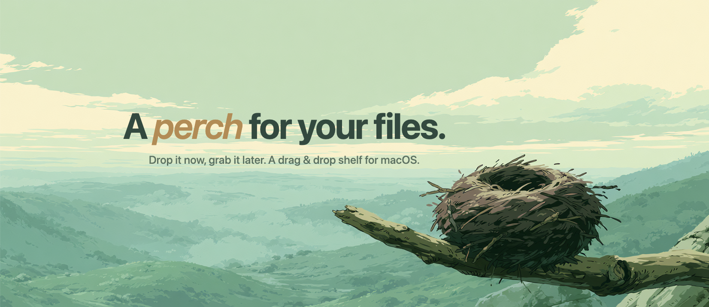

<p align="center">
  
</p>

<p align="center">
  A lightweight macOS shelf that appears during drag & drop.<br>
  Drop files in two steps instead of one, inspired by <a href="https://eternalstorms.at/yoink/mac/">Yoink</a>.
</p>

<p align="center">
  
  
  
</p>

---

## What is Perch?

Perch is a free, open-source alternative to Yoink. When you start dragging a file, a floating shelf slides in from the left edge of your screen. Drop files there, switch windows, then drag them out to their destination.

**Key features:**

- Automatic shelf: appears when you drag files, hides when empty
- File grouping: drop multiple files at once, they become a stack
- Split stacks: ungroup with one click
- Quick Look: preview files inside the shelf, or full-size in the system panel
- Lock: pinned files stay in the shelf after dragging them out, for repeated reuse
  (and follow the file if it gets moved or renamed)
- Copy & paste: paste files into the shelf with ⌘V, copy them out with ⌘C
  or the Copy button, hold ⌥ while dropping to copy instead of move
- List & two-column grid views, with file type and size at a glance
- Instant thumbnails: even huge RAW photos never block the UI
- Launch at login
- Localized (English, French)
- Zero dependencies: pure Swift/AppKit
- Menu bar app: no Dock icon, stays out of your way


https://github.com/user-attachments/assets/b6280f23-f6e7-437f-b24f-6beb213cf911


## Install

### Download

Download the latest version from [GitHub Releases](https://github.com/NathanLenias/Perch/releases), unzip, and drag `Perch.app` to your `/Applications` folder.

### Build from source

Requires Xcode 15+ and macOS 14 (Sonoma) or later.

```bash
git clone https://github.com/NathanLenias/Perch.git
cd Perch
xcodebuild -project Perch.xcodeproj -scheme Perch -configuration Release build
```

The built app is at `~/Library/Developer/Xcode/DerivedData/Perch-*/Build/Products/Release/Perch.app`. Copy it to `/Applications`.

### Permissions

Perch does not need any permission for drag & drop detection. macOS may ask for access to protected folders (Desktop, Documents, Downloads) the first time Perch reads a file from them outside of a drag, for example when pasting with ⌘V or generating a preview. Grant it once in the prompt; it stays manageable in System Settings > Privacy & Security > Files and Folders.

## Usage

1. Start dragging a file from Finder (or any app)
2. The shelf slides in from the left
3. Drop your file(s) on the shelf
4. Navigate to your destination
5. Drag file(s) out of the shelf to complete the drop

- **Drop 1 file** → single item with thumbnail
- **Drop multiple files** → grouped stack showing "N files"
- **Hover** → preview (eye), full-size Quick Look (arrows), lock, split stack, remove (×)
- **Double-click** → in-shelf preview with Copy and Open actions
- **Lock (padlock)** → the file stays in the shelf after drag-outs, ready to reuse
- **⌥ + drop** → copy instead of move, item stays in the shelf
- **⌘V on the shelf** → paste files from the clipboard, **⌘C** → copy the selection
- **⌥⌘P** → show or hide the shelf from anywhere
- **Cmd+click / Shift+click** → multi-select
- **Gear icon** → launch at login, about, quit

## Contributing

Contributions are welcome! The codebase is intentionally small and simple:

```
AppDelegate.swift           - Menu bar, coordination
DragDetector.swift          - System drag detection via NSEvent monitors
ShelfWindowController.swift - Floating panel, show/hide animation
ShelfViewController.swift   - Item management, selection, toolbar, Quick Look panel
ShelfItem.swift             - Data model (single & grouped items, bookmarks, async thumbnails)
ShelfItemView.swift         - List & grid views (shared base class)
PreviewViewController.swift - In-shelf Quick Look preview screen
DropTargetView.swift        - Drop target accepting file URLs
```

No external dependencies. No package managers. Just open `Perch.xcodeproj` and build.

## Support

Perch is free and open source. If it makes your day a little smoother, you can support its development:

[](https://ko-fi.com/perchformac)

## License

[MIT](LICENSE) · Nathan
